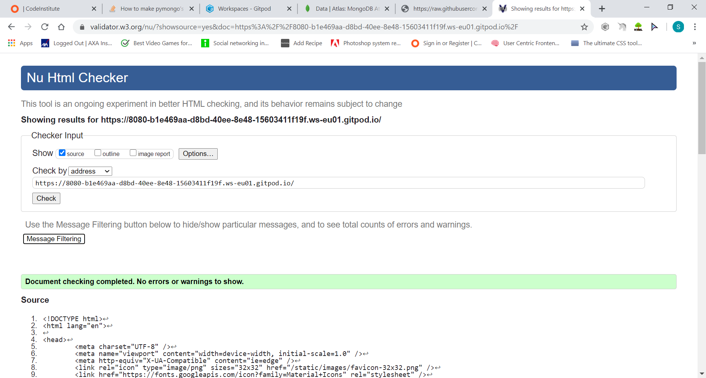
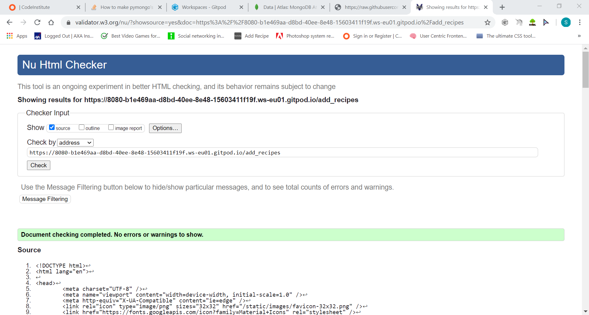
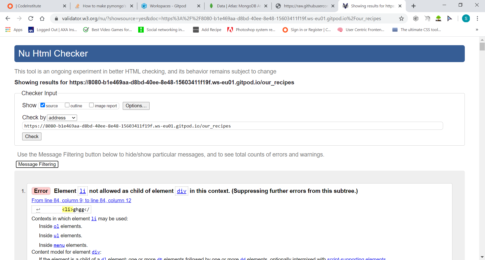
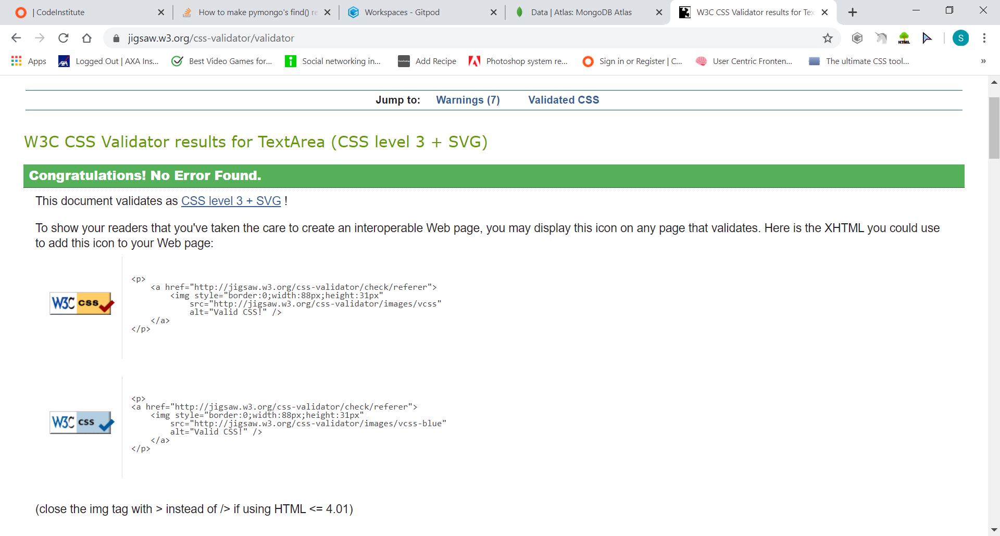
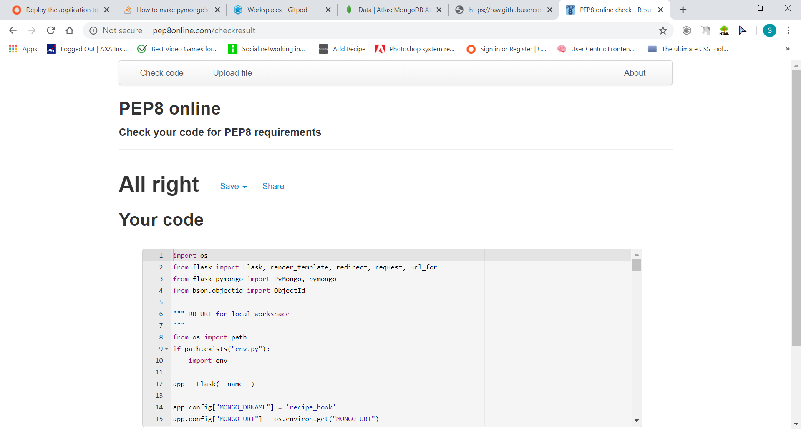

# Home Cooking
### Third Milestone Data Centric Development. Code Institute
---
This website is intended to be use as a bank of recipes. 
It is intended to be for Home Cook, users can add, edit or delete recipes.
There is  a section where equipments are listed for user to view with a link to recipes.

The webpage goals is to:
* Provide an easy access and easy to navigate sites with recipes.
* Allow the user to easily add and edit recipe with only a few steps.
* Promote equipments by linking them to recipes that need that particular equipment.

The customer goals:
* Find new recipe to try.
* Add their own recipe to the exiting bank of recipe.
* Edit recipe.
* View equipments showcase on the website.

### Demo 
---
Click here for a live Demo
[Home Cooking](https://ms3-recipe-book.herokuapp.com/ "Home Cooking")

### UX
---
1. As a user, i want to be able to view and access recipes.

2. As a user i want to add and recipes.

3. As a user i want to edit recipes.

4. As a user i want an easy website to add my recipes.

5. As a user i want to view equipments that i might need.
### UI
---
The website is kept simple and low profile to avoid unnecessary distraction
form the recipes.

This website has been built with the mobile first approach.
It is highly responsive, i have use Materialize for all the main skeleton
part of the website, where needed i have use CSS and Media-Queries to make it fully responsive.

### Wireframes

All drawings for the webistes can be found here
[Wireframes](https://github.com/Mrsebastino/MS3-RecipeBook/tree/master/static/wireframes/), they include desktop and mobile.

### Technologies Used
#### Languages
* HTML5
* CSS3
* JavaScript
* Python3
#### Librairies and Framework
* Materialize (1.0.0)
* Flask (1.1)
* Font-awsome (5.11.2)
* jQuery (3.5.0)
* Favicon 
* Google Font
#### Hosting
* GitHUb
* MongoDB
* Heroku
### Features
For this project i have used Materialize instead of Bootstrap. I used Materialize for the NavBar, for both small and large screen. I have reused and adapted the footer from my last project.

In the Navbar there is three links, add recipe, our recipe(where you can view all recipes) and equipments(where you can view all equipments).

In the future i would like to implement a secure login and password verification for users. So they can save on their page their favorite recipes.

I will also develop the equipment section. To make it an e-commerce.

I also want to create a search bar where we can target recipe by category and diffilculty.

### Bug encountered
Not a bug as such, more annoying, i normally use chrome but even with clearing my cache after each change in the CSS, it wouldn't always work. So switched to Firefox(awsome DevTools).

In my select form, i have had a problem with not being able to have it `required`. I have doen some research and it is an issue that has been raise to Materialize in 2017. It is apparently due to the fact 
> that Materialize converts select elements into unorderd lists, which can be validated. To quote Kevin at tutor support.

In the `card-reveal` from materialize for the recipes, i am using a `<li>`. But if i use the correct syntax, having my list inside a `<ol>` or `<ul>` i am uable to use a bullet point, if i remove the `<u>` the bullet point appear. It is again something to do Materialize.

I had a strange bug with my footer, it wouldn't stay at the bottom in all pages. It would work for the **landing page**, **add recipe** and **our recipe** but not **equipment**. Or if it work in **equipment** it would be in the middle of the other three pages. I tried `position:absolut  bottom:0  height:100px` and everything else i could find online. Finally with `bottom:0` and `padding-bottom:0` the footer finally sit properly on all pages.
### Testing
I have manually tested the app on Galasy S9, S8, A40.On Ipad 6
##### NavBar and Footer
All link in the Navbar and footer were tested manually, they all redirect you to the right page or website.
##### Add Recipe
I have added loads of recipe throuhgout the development, everthing work as it is intented. You are prompted to fill the empty fields that are set as required,except the **Choose type of meal**, i explained in the bug section why. I set an image size restriction in CSS, to prevent malicious user to upload to big image. I uploaded a very large image, and it got resize as excpected. The **Add recipe** take the user to their page, which is intented to be developped in the future with password and login, to allow the user to save their favorites recipes. From there the **submit** take them to the main bank of recipes where they can view their recipe added to the page.
##### Our Recipes
I tested the **edit** and **delete** button. The **edit** take you to the edit form, where all populated fields are showing up allowing the user to edit the recipe and submit it back to the database. The **delete** is prompting the user before deleting the recipe, the user can then choose **cancel** if they changed their mind.
##### Equipment
The equipment page allow the user to view recipes where the equipment is needed. I have limited the number of recipes to 5. But in each recipe card the equipment is listed. Note that the user can't edit or delete the equipments list. The user can add or edit equipments from the list provided in the select form.
### Validators
#### HTML5
No error were found on the 
Landing page 
No errors were found on add_recipe page 
The errors found on our_recipe page are caused by the use of jinja. I found this i put my`<li>` inside a `<ul>` the bullet point disappear. The others errors are stating that my `img src=""` is empty, because it's being populated thru an iteration of my DB 
The errors found on the equipment page are the of the same nature as above. The problem with `<li>` 
#### CSS
Here is the result of the validators  the 7 warnings are `-moz-transition -webkit-transition -0-transition`. I used them in two places, the last warning is for the first line.
#### Python3
No error were found for Ptyhon3 
## Deployment
The project is stored on GitHub and hosted on Heroku.
### Local Deployment
To run this project you will need the following installed:
- An IDE. My prefered IDE for this project was [GitPod](https://www.gitpod.io/)
- [MongoDB Atlas](https://www.mongodb.com/cloud/atlas)
- [PIP](https://pip.pypa.io/en/stable/installing/)
- [Python](https://www.python.org/) If you use a Mac, Python comes pre installed.

#### Directions
1. You can clone this repository directly into you editor by pasting the following command into the terminal:https://github.com/Mrsebastino/MS3-RecipeBook.git
2. Or you can save a copy of this directory by clicking the green button " Clone or download" then "Download Zip" and after that extract the Zip file to your folder, change the directory to the directory file location you just created.
3. If you don't have one already create a free MongoDB Atlas account
* Here you will create all your collections for your database.
* You will be given your identification link to your MongoDB_URI, you will need this for your .env files.
* To get the MongoDB_URI you click on "Overview/connect/connect your application" and copy and paste the link on the page.
4. In your root directory creat a .env file.
* At the top of file `import os`
* Set the connection to MongoDB.
  `os.environ["MONGO_URI"] = "here goes the link to your MongoDB database"`
5. In terminal, if you don't have already install Flask `pip3 install flask` and now you install requirements.txt `pip3 freeze --local > requirements.txt`
6. in the terminal type `python3 app.py` and  your project will run on a local port.

### Heroku Deployment
To deploy the project to [Heroku](https://heroku.com), you will to have an account if you don't already have one.
1. We already created our requirements.txt files at steps 5 of local deployment.
2. Create a **Procfile**, this will tell Heroku how to run the project, in the terminal:`echo web: python app.py > Procfile` the "app.py" is the name of the python files in our project, make sure you put the name of your files and "Procfile" in the terminal has to be capital P.
3. We now time to add, commit and push all to GitHub.
4. In Heroku create a **new app**, the name must be unique and set up a region(in my case Europe)
5. Now in Heroku we will link your **new app** to our GitHub repository.
* From the dashboard choose Deploy. Deployment method GitHub
* "enable automatic deployment"
6. Back into our terminal, we need to start the web process `heroku ps:scale web=1` this will scale the dynos.
7. In the Heroku dashboard click on setting.
* **Reveal Config Vars**
* IP: 0.0.0.0
* PORT: 8080
* MONGO_URI: "here goes the same link from your env.py"
8. The app will be deployed and clicking on **Open App**

## Credits

### Contents
I have referred to the three projects, that we build along in the module. More specifically The Thorin & Company, the chat app and the task app at multiple stage in my website development, specially  the setup of Flask, MongoDB and Heroku.

I also used **Stack Overflow** and **Pretty Printed** on youtube ( recommended by my mentor).

### Media
All the equipments images are taken from Google.
The background image in the landing page is from unsplash.

### Acknowledgements
I would like to thanks my Mentor Brian Macharia, all the tutors at the Code Institute and everyones on Slack.